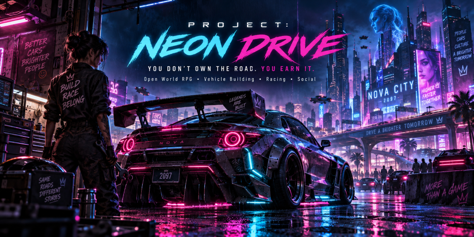

# zNeonDrive — PROJECT: NEON DRIVE

<p align="center">
  
</p>

<p align="center">

[](https://github.com/cvsz/zneondrive/actions/workflows/ci.yml)
[](https://github.com/cvsz/zneondrive/actions/workflows/codeql.yml)
[](https://github.com/cvsz/zneondrive/actions/workflows/runtime-go.yml)
[](https://github.com/cvsz/zneondrive/actions/workflows/dependency-review.yml)


[](./LICENSE)
[](https://github.com/cvsz/zneondrive/stargazers)
[](https://github.com/cvsz/zneondrive/forks)
[](https://github.com/cvsz/zneondrive/issues)
[](https://github.com/cvsz/zneondrive/commits/main)

</p>

> **You don't own the road. You earn it.**

zNeonDrive is the design and implementation repository for **PROJECT: NEON DRIVE**, an 18+ persistent online open-world RPG centered on vehicle building, racing, adventure, factions, relationships, crews, pets, and a long-lived social world.

## Product direction

- **World:** NOVA CITY, 2097
- **Genre:** Online Open World / RPG / Vehicle Building / Racing / Adventure / Social
- **World model:** persistent online world, server-authoritative by design
- **Player identity:** 1 account → 1 primary character → 1 starter vehicle
- **Vehicle philosophy:** a vehicle is a persistent identity object with ownership, builder, build, repair, race, and reputation history
- **VIP constraint:** garage/storage/convenience capacity only; no direct competitive performance advantage
- **Current phase:** **Phase 4.6 Trusted Ingress Security v1.0**
- **Selected implementation direction:** Unreal Engine 5.8 client/dedicated gameplay server + Go 1.27 service plane + PostgreSQL + Redis

## Runtime prototype v0.4

The repository now contains executable implementation scaffolding for both planes.

### Gameplay plane — Unreal

`game/` contains:
- UE 5.8 C++ project,
- Game / Editor / dedicated Server targets,
- default GameMode,
- prototype vehicle pawn,
- client input → server RPC → authoritative movement,
- replicated movement back to clients,
- source-build workflow baseline for a self-hosted UE 5.8 Linux runner.

See [game/README.md](./game/README.md).

### Durable service plane — Go

`services/game-api/` contains:
- Go 1.27 modular service binary,
- PostgreSQL account/session/character/vehicle/build/quest/inventory/blueprint/race persistence,
- hashed resume/session credentials,
- one-character + starter-vehicle bootstrap,
- immutable vehicle build revisions,
- optimistic revision checks,
- idempotent durable mutation operation IDs,
- MQ001–MQ100 sequential quest gate,
- MQ012 Roadworthy transition,
- authoritative race instance/checkpoint/result state,
- bounded local HTTP token-bucket abuse controls,
- Redis-coordinated distributed rate-limit state with bounded local fallback,
- explicit trusted-ingress client identity policy,
- credential-safe rate-limit security events,
- unit, PostgreSQL and Redis integration tests.

Local stack:

```bash
cp .env.example .env
docker compose up --build
curl http://127.0.0.1:18080/healthz
```

Host defaults intentionally avoid common 5432/6379 conflicts:
- PostgreSQL: `55432`
- Redis: `56379`
- Game API: `18080`

See [Runtime Prototype v0.4](./docs/runtime-prototype-v0.4.md).

### Authenticated runtime integration — v0.5

The gameplay/service boundary now has an implemented source contract:
- Unreal client bootstraps/resumes durable identity through the Go API,
- session credentials stay client-side; dedicated servers receive only short-lived one-time gameplay tickets,
- Go stores gameplay tickets only as hashes and atomically consumes them once,
- the internal redemption endpoint requires a server-only shared key,
- the dedicated server obtains the authoritative PostgreSQL snapshot directly from Go,
- durable VehicleID, build revision, active parts, and Roadworthy state are bound on the authority and replicated to clients,
- networked prototype movement remains blocked until durable identity is server-bound,
- HTTP/PostgreSQL E2E proves ticket issuance, single-use redemption, MQ001 persistence, and resume-key reconnect.

See [Runtime Integration v0.5](./docs/runtime-integration-v0.5.md).

### Inventory-authoritative rebuild — v0.6

The first Garage 17 rebuild state is now implemented in the durable service plane:
- PostgreSQL inventory quantities and blueprint unlocks,
- MQ004 idempotent salvage grant,
- MQ005 starter-rebuild blueprint unlock,
- MQ009 idempotent recovered-part grant,
- exact catalog validation against the canonical vehicle-part catalog,
- atomic consume/return inventory accounting when a build revision changes,
- operation-ID replay binding to the exact build hash,
- reconnect persistence for inventory, blueprints, and the active build,
- Unreal snapshot parsing for inventory and blueprint state.

See [Runtime Inventory + Rebuild v0.6](./docs/runtime-inventory-rebuild-v0.6.md).

### Server-authoritative race lifecycle — v0.7

The first durable race authority slice is implemented in Go/PostgreSQL:
- race start is restricted to the dedicated-server shared-key boundary,
- the service derives account/character/vehicle ownership from PostgreSQL,
- the vehicle must already be Roadworthy,
- every race instance binds the exact active build revision and validation hash at start,
- checkpoint indices must match the server-side cursor and elapsed time must increase monotonically,
- finish must match the recorded checkpoint count and exceed the last checkpoint time,
- start/checkpoint/finish writes are idempotent and reject operation-key payload reuse,
- final result hashes bind race identity, account/character/vehicle, immutable build evidence, checkpoint count, and finish time.

This is service-plane evidence only; live packaged Unreal race transport, physics anti-cheat, playable race content, load/soak, HA/DR, and production deployment remain open.

See [Runtime Authoritative Race v0.7](./docs/runtime-authoritative-race-v0.7.md).

### Runtime abuse resistance — v0.8

The Go service process wraps public and internal mutation traffic in a bounded token-bucket middleware:
- bootstrap/state/game-ticket/quest/build endpoints are limited by remote identity or hashed bearer identity,
- internal ticket and race mutations are rate-limited before reaching the existing server-only authorization boundary,
- raw bearer credentials are not retained in limiter keys,
- limiter bucket cardinality is bounded with stale/oldest eviction,
- rejected requests return HTTP `429` with `Retry-After`,
- `/healthz` remains exempt for orchestration probes.

See [Runtime Security Hardening v0.8](./docs/runtime-security-hardening-v0.8.md).

### Distributed abuse controls — v0.9

The v0.8 limiter has a Redis coordination layer for multi-process API deployments:
- each limited request uses an atomic Redis Lua token-bucket decision,
- independent API limiter instances share one Redis abuse budget,
- distributed bucket keys reuse the credential-safe hashed identity scheme,
- Redis limiter keys expire automatically,
- short Redis dial/I/O deadlines bound dependency impact,
- Redis failure falls back to the bounded local token bucket rather than removing rate limiting,
- rejection and fallback events are logged with scope + hashed bucket only,
- Compose wires the Go API to Redis,
- Runtime Go CI includes a Redis service and verifies shared budget/refill behavior across independent limiter instances.

Redis remains **ephemeral abuse-control coordination only**. PostgreSQL and the dedicated gameplay server remain authoritative for durable/gameplay state.

See [Runtime Distributed Abuse Controls v0.9](./docs/runtime-distributed-abuse-controls-v0.9.md).

### Trusted ingress identity — v1.0

The service plane now has an explicit proxy trust boundary for source-IP based abuse controls:
- `RemoteAddr` remains authoritative by default and forwarding headers are ignored for direct/untrusted peers,
- `TRUSTED_PROXY_CIDRS` explicitly allowlists ingress/proxy peers that may influence client identity,
- invalid CIDR configuration fails startup instead of silently broadening trust,
- trusted `X-Forwarded-For` chains are evaluated from right to left and skip only configured trusted proxy hops,
- malformed forwarding chains fail closed to the immediate socket peer,
- forwarded header contents are not written to the malformed-chain security event,
- unit tests cover spoof resistance, multi-hop chains, malformed values, exact-IP/CIDR configuration, and distinct client buckets behind one ingress.

This is source/unit evidence only. It does not prove a deployed ingress sanitizes forwarding headers correctly or blocks direct bypass traffic, and it does not close real multi-replica HTTP load/soak, ranked anti-cheat, deployed observability/SLO, HA/DR, backup/restore, or production deployment gates.

See [Runtime Trusted Ingress Identity v1.0](./docs/runtime-trusted-ingress-v1.0.md).

## Present to a client now

Start with [client/README.md](./client/README.md).

Run the interactive offline presentation demo:

```bash
python3 -m http.server 8080 --directory demo
```

Open `http://localhost:8080`.

The browser demo is presentation-only; the Unreal/Go code is the implementation baseline. Neither is a claim that the full MMORPG is production-ready.

## Documentation

Start with the complete [PROJECT: NEON DRIVE documentation index](./docs/README.md). It covers product requirements, API/data/networking contracts, gameplay systems, security/threat modeling, testing, observability/SLO targets, deployment, backup/restore/DR, incident response, accessibility, localization, moderation, privacy, live ops, release readiness, governance and support.

## Canonical design

- [Original Story Bible / Master Plot](./zNeonDrive-concept.md)
- [Game Design Bible v0.2](./docs/game-design-bible-v0.2.md)
- [Game Design Bible v0.1](./docs/game-design-bible-v0.1.md)
- [Vertical Slice v0.2](./docs/vertical-slice-v0.2.md)
- [Runtime Prototype v0.4](./docs/runtime-prototype-v0.4.md)
- [Runtime Integration v0.5](./docs/runtime-integration-v0.5.md)
- [Runtime Inventory + Rebuild v0.6](./docs/runtime-inventory-rebuild-v0.6.md)
- [Runtime Authoritative Race v0.7](./docs/runtime-authoritative-race-v0.7.md)
- [Runtime Security Hardening v0.8](./docs/runtime-security-hardening-v0.8.md)
- [Runtime Distributed Abuse Controls v0.9](./docs/runtime-distributed-abuse-controls-v0.9.md)
- [Runtime Trusted Ingress Identity v1.0](./docs/runtime-trusted-ingress-v1.0.md)
- [NOVA CITY World Bible](./docs/nova-city-world-bible.md)
- [Gameplay Systems](./docs/gameplay-systems.md)
- [Architecture](./docs/architecture.md)
- [Content Contracts](./docs/content-contracts.md)
- [Roadmap](./ROADMAP.md)
- [Implementation Checklist](./IMPLEMENTATION-CHECKLIST.md)
- [Complete Documentation Index](./docs/README.md)
- [Governance](./GOVERNANCE.md)
- [Support](./SUPPORT.md)

## Production-direction ADRs

- [ADR-0001 — Server-authoritative state](./docs/adr/0001-server-authoritative-state.md)
- [ADR-0002 — Starter vehicle identity](./docs/adr/0002-starter-vehicle-identity.md)
- [ADR-0003 — Executable reference runtime](./docs/adr/0003-executable-reference-runtime.md)
- [ADR-0004 — Unreal Engine 5.8 playable client + dedicated gameplay server](./docs/adr/0004-unreal-engine-client-and-gameplay-server.md)
- [ADR-0005 — Go/PostgreSQL/Redis durable service plane](./docs/adr/0005-durable-service-plane.md)
- [ADR-0006 — Phase-gated deployment](./docs/adr/0006-phase-gated-deployment.md)

## Machine-readable design catalogs

Content under `design/catalog/` provides stable IDs and implementation contracts:
- 25 named launch characters
- 5 primary factions
- 10 launch districts
- 100 main-story quest records across 7 chapters
- 30 side-content seeds
- vehicle part taxonomy
- functional pet archetypes
- Garage 17 / Foundry 9 vertical-slice proof catalog

Schemas live under `design/schemas/`.

## Evidence layers

### Python reference oracle
`src/zneondrive/` remains a dependency-free contract oracle for core authority invariants.

### Go durable runtime
`services/game-api/` implements the persistent service-plane slice, including durable rebuild, authoritative race lifecycle state, bounded local rate limiting, Redis-coordinated distributed rate-limit state, trusted-ingress identity resolution, and credential-safe security events.

### Unreal runtime
`game/` contains the first gameplay-plane source baseline. A successful self-hosted UE source build is still required before claiming Unreal build evidence.

Run repository checks:

```bash
make ci
```

## Core loop

```text
Arrive in NOVA CITY
→ receive the broken prototype
→ rebuild the first vehicle
→ take jobs / discover districts / earn reputation
→ tune and reconfigure the same vehicle
→ build relationships and faction standing
→ enter underground and sanctioned competition
→ qualify for NOVA GRAND PRIX
→ expose PROJECT DRIVE ZERO
→ choose the future governance of mobility
→ continue into seasons, crews, world events, and expansions
```

## Fairness rules

1. Ranked outcomes are based on skill, earned/configured performance, event rules, and validated state.
2. VIP cannot add hidden horsepower, grip, durability, matchmaking priority, reward multipliers, or race-stat multipliers.
3. Competitive vehicle builds must be server-validatable and bind results to an exact accepted revision.
4. Rewardable mutations must be idempotent.
5. Reputation and relationship consequences are persistent gameplay state.
6. Endgame choices may alter a player's world state without breaking shared-world consistency.

## Status

**Implemented now:** pre-production design/content contracts, vertical-slice specification, client presentation package, Python authority oracle, Unreal C++ source integration layer, Go durable service plane, PostgreSQL persistence, one-time gameplay tickets, inventory/blueprint persistence, catalog-validated transactional rebuilds, authoritative PostgreSQL race instances/checkpoints/results, bounded local HTTP rate limiting, Redis-coordinated shared limiter state with local fallback, trusted-proxy source identity resolution with explicit CIDR allowlisting, credential-safe rate-limit security events, committed Go module lock, HTTP/PostgreSQL reconnect-ticket E2E, Redis limiter integration evidence, local Compose stack, and CI/security validation.

**Still evidence-gated:** successful UE 5.8 source-build artifact, live packaged Unreal↔Go client/server and race E2E, Garage 17 playable content, final vehicle physics, playable Garage 17 rebuild interaction, relationships/factions, deployed ingress header-sanitization/direct-bypass evidence, real multi-replica distributed-limiter load/soak, auth telemetry correlation, race anti-cheat/impossible-state detection, matchmaking, observability/SLO evidence, backup/restore, HA/DR, platform certification, and production deployment.

## License

MIT. See [LICENSE](./LICENSE).
