# Launch Character Roster v1 — PROJECT: NEON DRIVE

Twelve launch characters for NOVA CITY 2097: four humanoids and eight
anthropomorphic ("humanoid wild") racers. Portraits are flat-vector concept
art; final in-engine models are separate production work.

- Portraits: `../web/assets/characters/<id>.svg`
- Machine roster: `../web/characters.json`
- Generator: `../tools/generate_characters.py` (re-run to regenerate all art)

## Humanoids

| Portrait | Name | Role | Faction |
|---|---|---|---|
| 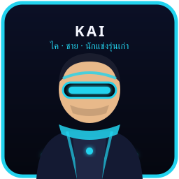 | ไค · KAI — ชาย นักแข่งรุ่นเก๋า | Veteran Racer / Garage Chief | Free Roads |
| 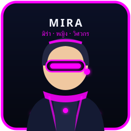 | มิร่า · MIRA — หญิง วิศวกร | Race Engineer / Navigator | Mechanist Guild |
| 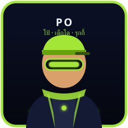 | โป้ · PO — เด็กโต รุกกี้ | Rookie Runner | Free Roads |
| 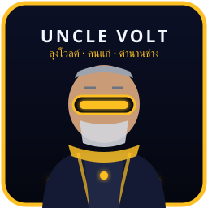 | ลุงโวลต์ · UNCLE VOLT — คนแก่ ตำนานช่าง | Retired Legend / Master Mechanic | Mechanist Guild |

## Anthropomorphic crew

| Portrait | Name | Role | Faction |
|---|---|---|---|
| 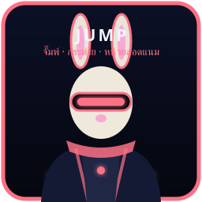 | จั๊มพ์ · JUMP — กระต่าย สอดแนม | Sprinter / Scout | Iron Wolves |
| 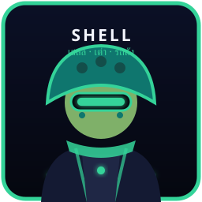 | เชลล์ · SHELL — เต่า รถถัง | Heavy Defender / Tanker | NOVA Authority |
| 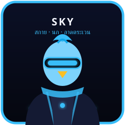 | สกาย · SKY — นก ลาดตระเวน | Aerial Recon | VANTEX |
| 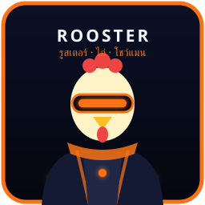 | รูสเตอร์ · ROOSTER — ไก่ โชว์แมน | Showman / Trick Driver | VANTEX |
| 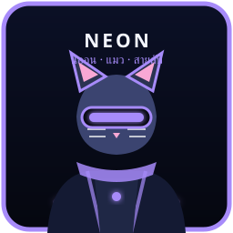 | นีออน · NEON — แมว สายลับ | Agile Infiltrator | Iron Wolves |
| 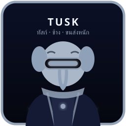 | ทัสก์ · TUSK — ช้าง ขนส่งหนัก | Heavy Hauler | NOVA Authority |
| 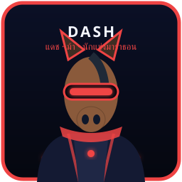 | แดช · DASH — ม้า มาราธอน | Endurance Racer | Free Roads |
| 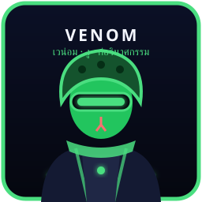 | เวน่อม · VENOM — งู ก่อวินาศกรรม | Saboteur | Iron Wolves |

## Gameplay notes

- Stats (SPD/HDL/ARM/TEC/CHR, 1–10) live in `web/characters.json` and are
  tuning inputs only — the dedicated server remains gameplay authority and
  must re-validate any client claim derived from these values.
- No stat, portrait, or bio grants ranked advantage; pets/companions rules in
  the design bible still apply.
- Faction ties reuse the five canonical launch factions; standing stays
  independent persistent state per the factions doctrine.
